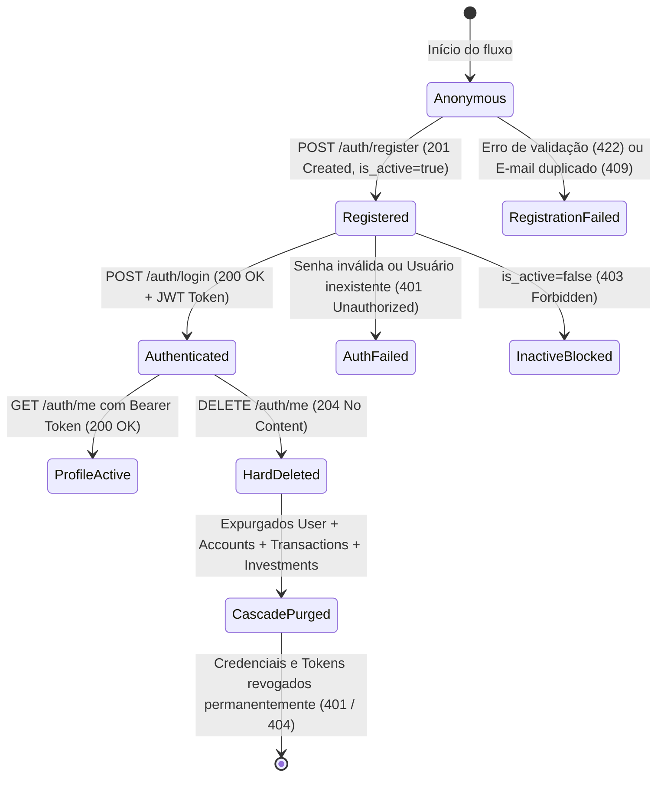

# Data Model & Entity Specifications: Auth Module

**Feature**: `001-auth-user-management`
**Date**: 2026-09-23
**Status**: Completed

## 1. Entities & Data Contracts

### 1.1 `UserCreate` (Request Payload)
Entidade de entrada para os endpoints de cadastro (`POST /api/v1/auth/register`) e autenticação (`POST /api/v1/auth/login`).

| Campo | Tipo | Obrigatório | Regras de Validação & Limites | Descrição |
| :--- | :--- | :--- | :--- | :--- |
| `email` | `string` | **Sim** | Formato de e-mail RFC válido (`format: email`). Unicidade obrigatória no cadastro. | E-mail do usuário utilizado como identificador de login. |
| `password` | `string` | **Sim** | Tamanho mínimo: **8 caracteres**. Tamanho máximo: **72 caracteres**. Proibido string vazia. | Senha de acesso do usuário (criptografada no backend). |

*Nota de Segurança (Mass Assignment)*: Qualquer atributo adicional enviado no payload (ex: `is_active`, `role`, `id`) é sumariamente rejeitado com `422 Unprocessable Entity`.

---

### 1.2 `UserResponse` (Response Payload)
Representação pública da conta de usuário retornada nos endpoints `POST /api/v1/auth/register` (201) e `GET /api/v1/auth/me` (200).

| Campo | Tipo | Formato | Restrições de Negócio & Segurança |
| :--- | :--- | :--- | :--- |
| `id` | `string` | `uuid` (v4) | Identificador imutável gerado pelo sistema. |
| `email` | `string` | `email` | E-mail cadastrado pelo usuário. |
| `is_active` | `boolean` | boolean | Status da conta. Por padrão `true` na criação. Se `false`, o login é bloqueado (`403 Forbidden`). |
| `created_at` | `string` | `date-time` | Carimbo de data/hora no padrão ISO 8601 UTC. |

*Proteção de Dados*: Sob nenhuma hipótese os campos `password` ou `password_hash` são expostos nesta entidade.

---

### 1.3 `Token` (Authentication Response)
Entidade retornada em caso de autenticação bem-sucedida em `POST /api/v1/auth/login` (200).

| Campo | Tipo | Valor / Padrão | Descrição |
| :--- | :--- | :--- | :--- |
| `access_token` | `string` | JWT válido (3 blocos em base64 codificados) | Token de portador contendo claims de identidade do usuário (`sub` = user_id) e expiração. |
| `token_type` | `string` | `"bearer"` | Esquema de autenticação utilizado no cabeçalho `Authorization`. |

---

### 1.4 `HTTPValidationError` & `ValidationError` (Error Contracts)
Estrutura contratual emitida em respostas com status `422 Unprocessable Entity` quando há violação de schema ou campos obrigatórios.

- `HTTPValidationError`:
  - `detail`: Lista de `ValidationError`
- `ValidationError`:
  - `loc`: Array indicando a localização do erro (ex: `["body", "email"]` ou `["body", "password"]`)
  - `msg`: Mensagem legível descrevendo o motivo da falha de validação
  - `type`: Identificador do erro (ex: `value_error.missing`, `string_too_short`, `string_too_long`)

---

### 1.5 Correlated Entities (Cascade Delete Scope)
Entidades pertencentes ao usuário que devem ser integralmente expurgadas quando `DELETE /api/v1/auth/me` é executado:

| Entidade | Vínculo com Usuário | Regra de Deleção em Cascata | Verificação de Inacessibilidade |
| :--- | :--- | :--- | :--- |
| `Account` | `user_id` (FK obrigatória) | Todas as carteiras do usuário são excluídas. | `GET /api/v1/accounts/{id}` torna-se inacessível (`401`/`404`). |
| `Transaction` | `user_id` e `conta_id` | Todas as transações do usuário são expurgadas. | `GET /api/v1/transactions/{id}` torna-se inacessível (`401`/`404`). |
| `Investment` | `user_id` | Todas as posições de custódia são expurgadas. | `GET /api/v1/investments/{id}` torna-se inacessível (`401`/`404`). |

---

## 2. Lifecycle & State Transitions

---

## 3. Matriz de Validação e Códigos de Status

| Operação | Entrada | Código Esperado | Contrato de Resposta |
| :--- | :--- | :--- | :--- |
| `POST /register` | E-mail novo + Senha válida (8-72 chars) | `201 Created` | `UserResponse` |
| `POST /register` | E-mail já existente | `409 Conflict` | Mensagem de violação de unicidade |
| `POST /register` | Senha < 8 caracteres | `422 Unprocessable` | `HTTPValidationError` (`loc: ["body", "password"]`) |
| `POST /register` | Senha > 72 caracteres | `422 Unprocessable` | `HTTPValidationError` (`loc: ["body", "password"]`) |
| `POST /register` | E-mail malformado ou campos ausentes | `422 Unprocessable` | `HTTPValidationError` |
| `POST /register` | Campos extras não mapeados (Mass Assignment) | `422 Unprocessable` | `HTTPValidationError` |
| `POST /login` | Credenciais válidas existentes | `200 OK` | `Token` (`access_token`, `token_type`) |
| `POST /login` | Senha incorreta ou e-mail inexistente | `401 Unauthorized` | Detalhe de falha de autenticação |
| `POST /login` | Conta desativada (`is_active: false`) | `403 Forbidden` | Detalhe de recusa por status inativo |
| `POST /login` | Campos vazios ou nulos | `422 Unprocessable` | `HTTPValidationError` |
| `GET /me` | Cabeçalho `Authorization: Bearer <valid>` | `200 OK` | `UserResponse` |
| `GET /me` | Sem cabeçalho, token expirado ou malformado | `401 Unauthorized` | Detalhe de autenticação requerida |
| `DELETE /me` | Cabeçalho `Authorization: Bearer <valid>` | `204 No Content` | Resposta vazia |
| `DELETE /me` | Sem token ou com token inválido | `401 Unauthorized` | Detalhe de autenticação requerida |
| `POST /login` (pós-delete) | Credenciais da conta deletada | `401 Unauthorized` | Bloqueio imediato de acesso |
| `GET /me` (pós-delete) | Token emitido antes do delete | `401 Unauthorized` | Rejeição imediata de sessão |
