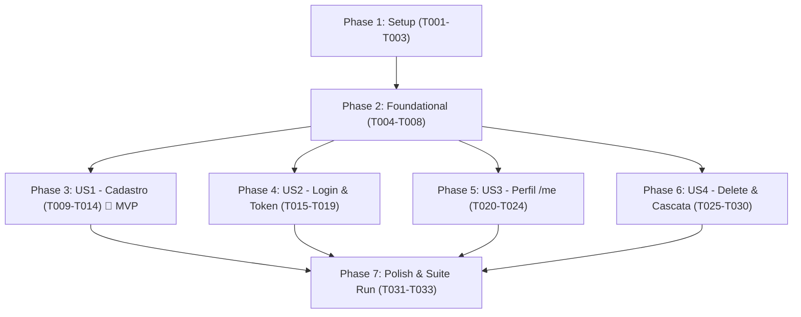

# Tasks: Autenticação e Gestão de Usuário (Auth API Test Automation)

**Input**: Feature specification from `specs/001-auth-user-management/spec.md`, implementation plan from `specs/001-auth-user-management/plan.md`, data model from `specs/001-auth-user-management/data-model.md`, and contracts from `specs/001-auth-user-management/contracts/`.

---

## Phase 1: Setup (Shared Infrastructure)

**Purpose**: Inicialização das configurações de ambiente, estrutura de dados e geradores dinâmicos de teste.

- [ ] T001 Configurar endpoint canônico (`http://100.75.210.114:8000`) e timeouts da API Finance Organizer em `src/test/resources/config/environments.json`
- [ ] T002 [P] Criar diretórios de payloads e schemas em `src/test/resources/data/payloads/auth/` e `src/test/resources/data/schemas/auth/`
- [ ] T003 [P] Implementar geradores de senhas de fronteira (8, 72, 7 e 73 caracteres) em `src/test/java/utils/DataGenerator.java`

---

## Phase 2: Foundational (Blocking Prerequisites)

**Purpose**: Contratos de schemas reutilizáveis e templates base de payload que bloqueiam todas as User Stories.

**⚠️ CRITICAL**: Nenhuma User Story pode ser implementada antes da conclusão desta fase.

- [ ] T004 [P] Implementar schema de contrato `UserResponse` com Karate fuzzy matchers em `src/test/resources/data/schemas/auth/user-response-schema.json`
- [ ] T005 [P] Implementar schema de contrato `Token` com Karate fuzzy matchers em `src/test/resources/data/schemas/auth/token-schema.json`
- [ ] T006 [P] Implementar schema de contrato `HTTPValidationError` com validação de array `detail` em `src/test/resources/data/schemas/auth/validation-error-schema.json`
- [ ] T007 [P] Criar template de payload base de cadastro em `src/test/resources/data/payloads/auth/register-request.json`
- [ ] T008 [P] Criar template de payload base de login em `src/test/resources/data/payloads/auth/login-request.json`

**Checkpoint**: Infraestrutura de contratos e payloads base concluída. As User Stories podem ser implementadas.

---

## Phase 3: User Story 1 - Cadastro e Validação de Contas de Usuário (Priority: P1) 🎯 MVP

**Goal**: Permitir o cadastro de novos usuários via `POST /api/v1/auth/register`, cobrindo limites de senha (8 a 72 chars), validações de formato, unicidade de e-mail (409 Conflict) e proteção contra Mass Assignment (422 Unprocessable Entity).

**Independent Test**: Executar `mvn test -Dkarate.tags="@register"` e validar aprovação de 100% dos cenários (201 em senhas válidas, 409 em e-mail duplicado, 422 em violações de borda, e-mail malformado ou campos extras).

- [ ] T009 [US1] Criar arquivo de feature com Background e tags `@auth` e `@register` em `src/test/java/features/auth/register.feature`
- [ ] T010 [P] [US1] Implementar cenários felizes SCEN-REG-01 (senha de 8 chars) e SCEN-REG-02 (senha de 72 chars) validando `UserResponse` em `src/test/java/features/auth/register.feature`
- [ ] T011 [P] [US1] Implementar cenários negativos de fronteira de senha SCEN-REG-05 (7 chars) e SCEN-REG-06 (73 chars) validando HTTP 422 em `src/test/java/features/auth/register.feature`
- [ ] T012 [P] [US1] Implementar cenários de validação de formato SCEN-REG-03 (e-mail malformado), SCEN-REG-07 (campos ausentes) e SCEN-REG-08 (tipagem incorreta) validando HTTP 422 em `src/test/java/features/auth/register.feature`
- [ ] T013 [US1] Implementar cenário de conflito cadastral SCEN-REG-04 validando HTTP 409 Conflict para e-mail duplicado em `src/test/java/features/auth/register.feature`
- [ ] T014 [US1] Implementar cenário de proteção contra Mass Assignment SCEN-REG-09 validando HTTP 422 para injeção de campos extras em `src/test/java/features/auth/register.feature`

**Checkpoint**: User Story 1 (MVP) concluída e validável de forma 100% independente.

---

## Phase 4: User Story 2 - Autenticação e Emissão de Tokens de Acesso (Priority: P1)

**Goal**: Permitir a autenticação de usuários ativos via `POST /api/v1/auth/login`, emitindo token JWT válido (200 OK), rejeitando credenciais incorretas (401 Unauthorized), bloqueando contas desativadas (403 Forbidden) e validando schemas de requisição (422).

**Independent Test**: Executar `mvn test -Dkarate.tags="@login"` e validar emissão correta de `access_token` e `token_type: "bearer"`, recusa com 401 para credenciais divergentes, bloqueio 403 para contas inativas e 422 para payloads em branco.

- [ ] T015 [US2] Criar arquivo de feature com Background e tags `@auth` e `@login` em `src/test/java/features/auth/login.feature`
- [ ] T016 [US2] Implementar cenário de sucesso SCEN-LOG-01 cadastrando usuário e validando emissão de token JWT contra `token-schema.json` em `src/test/java/features/auth/login.feature`
- [ ] T017 [P] [US2] Implementar cenários negativos de credenciais SCEN-LOG-02 (senha incorreta) e SCEN-LOG-03 (e-mail inexistente) validando HTTP 401 Unauthorized em `src/test/java/features/auth/login.feature`
- [ ] T018 [P] [US2] Implementar cenário de segurança SCEN-LOG-04 para conta inativa (`is_active: false`) validando HTTP 403 Forbidden em `src/test/java/features/auth/login.feature`
- [ ] T019 [P] [US2] Implementar cenários de validação de payload SCEN-LOG-05 (campos vazios ou nulos) validando HTTP 422 em `src/test/java/features/auth/login.feature`

**Checkpoint**: User Stories 1 e 2 totalmente funcionais e integradas de forma independente.

---

## Phase 5: User Story 3 - Consulta de Perfil do Usuário Autenticado (Priority: P2)

**Goal**: Permitir a consulta cadastral via `GET /api/v1/auth/me` utilizando Bearer token, garantindo que o retorno seja compatível com `UserResponse` sem expor hashes de senha, e rejeitando acessos não autorizados com 401 Unauthorized.

**Independent Test**: Executar `mvn test -Dkarate.tags="@me"` e validar retorno `200 OK` com os atributos exatos do usuário autenticado, ausência de dados sensíveis e recusa com `401 Unauthorized` para requisições sem token, com token malformado ou expirado.

- [ ] T020 [US3] Criar arquivo de feature com Background e tags `@auth` e `@me` em `src/test/java/features/auth/me-get.feature`
- [ ] T021 [US3] Implementar cenário feliz SCEN-ME-01 com Bearer token válido, validando contrato `user-response-schema.json` e ausência de hash de senha em `src/test/java/features/auth/me-get.feature`
- [ ] T022 [P] [US3] Implementar cenário de ausência de cabeçalho Authorization SCEN-ME-02 validando HTTP 401 Unauthorized em `src/test/java/features/auth/me-get.feature`
- [ ] T023 [P] [US3] Implementar cenário de cabeçalho Authorization malformado SCEN-ME-03 (sem prefixo Bearer) validando HTTP 401 Unauthorized em `src/test/java/features/auth/me-get.feature`
- [ ] T024 [P] [US3] Implementar cenários de token adulterado ou expirado SCEN-ME-04 validando HTTP 401 Unauthorized em `src/test/java/features/auth/me-get.feature`

**Checkpoint**: User Stories 1, 2 e 3 validadas e funcionais.

---

## Phase 6: User Story 4 - Exclusão Imediata da Conta e Efeito Cascata Transacional (Priority: P2)

**Goal**: Permitir a exclusão definitiva (Hard Delete) via `DELETE /api/v1/auth/me` retornando 204 No Content, garantindo que registros filhos (`accounts`, `transactions`, `investments`) sejam expurgados sem erro de integridade referencial (500) e que o acesso seja imediatamente revogado.

**Independent Test**: Executar `mvn test -Dkarate.tags="@delete"` e comprovar retorno 204 No Content na deleção com dados filhos, ausência de erro 500, bloqueio subsequente de login (401), rejeição do token anterior (401) e recusa de acesso aos recursos órfãos (404/401).

- [ ] T025 [US4] Criar arquivo de feature com Background e tags `@auth` e `@delete` em `src/test/java/features/auth/me-delete.feature`
- [ ] T026 [US4] Implementar cenário simples de exclusão imediata SCEN-DEL-01 para usuário sem vínculos validando HTTP 204 No Content em `src/test/java/features/auth/me-delete.feature`
- [ ] T027 [US4] Implementar cenário de limpeza em cascata SCEN-DEL-02 (setup com contas, transações e investimentos), disparo de DELETE e validação de inacessibilidade dos IDs órfãos em `src/test/java/features/auth/me-delete.feature`
- [ ] T028 [P] [US4] Implementar validação pós-deleção de bloqueio de login subsequente SCEN-DEL-03 validando HTTP 401 em `src/test/java/features/auth/me-delete.feature`
- [ ] T029 [P] [US4] Implementar validação pós-deleção de rejeição de token revogado SCEN-DEL-04 validando HTTP 401 em `src/test/java/features/auth/me-delete.feature`
- [ ] T030 [P] [US4] Implementar cenário de tentativa de exclusão sem autorização SCEN-DEL-05 validando HTTP 401 em `src/test/java/features/auth/me-delete.feature`

**Checkpoint**: Todas as 4 User Stories da matriz de Auth implementadas e independentemente testáveis.

---

## Phase 7: Polish & Cross-Cutting Concerns

**Purpose**: Validação final de paralelismo seguro, privacidade de logs e integridade da suíte completa.

- [ ] T031 Atualizar filtros de execução e paralelismo de 3 threads em `src/test/java/features/TestRunner.java`
- [ ] T032 [P] Configurar mascaramento de headers de autorização e senhas em `src/test/resources/logback-test.xml`
- [ ] T033 Executar suíte completa `mvn test -Dkarate.tags="@auth"` e verificar relatório HTML em `target/karate-reports/karate-summary.html` per `specs/001-auth-user-management/quickstart.md`

---

## Dependencies & Execution Order

### Phase Dependencies



### User Story Dependencies

- **US1 (Cadastro)**: Depende apenas da Phase 2 (Foundational). Pode ser executada imediatamente como MVP.
- **US2 (Login)**: Depende da Phase 2. Pode criar dinamicamente seus usuários de teste usando helper ou o endpoint de registro.
- **US3 (Perfil /me)**: Depende da Phase 2. Executa fluxo autocontido de registro/login para obter token e consultar perfil.
- **US4 (Delete & Cascata)**: Depende da Phase 2. Executa fluxo autocontido de setup de dados e expurgo.

---

## Parallel Execution Opportunities

```bash
# Execução paralela de tarefas de Setup e Contratos (Fase 1 e 2):
Task T002: "Criar diretórios de payloads e schemas"
Task T003: "Implementar geradores de senhas de fronteira"
Task T004: "Implementar schema de contrato UserResponse"
Task T005: "Implementar schema de contrato Token"
Task T006: "Implementar schema de contrato HTTPValidationError"
Task T007: "Criar template de payload base de cadastro"
Task T008: "Criar template de payload base de login"

# Execução paralela dentro de User Story 1 (após T009):
Task T010: "Implementar cenários felizes SCEN-REG-01 e SCEN-REG-02"
Task T011: "Implementar cenários negativos de fronteira SCEN-REG-05 e SCEN-REG-06"
Task T012: "Implementar cenários de validação de formato SCEN-REG-03, SCEN-REG-07 e SCEN-REG-08"

# Execução paralela dentro de User Story 2 (após T015):
Task T017: "Implementar cenários negativos de credenciais SCEN-LOG-02 e SCEN-LOG-03"
Task T018: "Implementar cenário de segurança SCEN-LOG-04 para conta inativa"
Task T019: "Implementar cenários de validação de payload SCEN-LOG-05"
```

---

## Implementation Strategy

### MVP First (User Story 1 Only)
1. Concluir **Phase 1** (Setup) e **Phase 2** (Foundational).
2. Implementar **Phase 3** (User Story 1 - Cadastro).
3. **VALIDAÇÃO MVP**: Executar `mvn test -Dkarate.tags="@register"`. Todos os cenários de cadastro e validação de schema devem passar com 0 falhas.

### Entrega Incremental
1. Concluir Setup + Foundational (Base pronta).
2. Entregar US1 (Cadastro / Regras de Senha / 409 / 422) → Testar com `@register`.
3. Entregar US2 (Autenticação / JWT / 401 / 403) → Testar com `@login`.
4. Entregar US3 (Perfil / Segurança de Headers / Zero Leaks) → Testar com `@me`.
5. Entregar US4 (Hard Delete / Cascata / Revogação) → Testar com `@delete`.
6. Concluir Polish e validação paralela de 3 threads com `@auth`.
