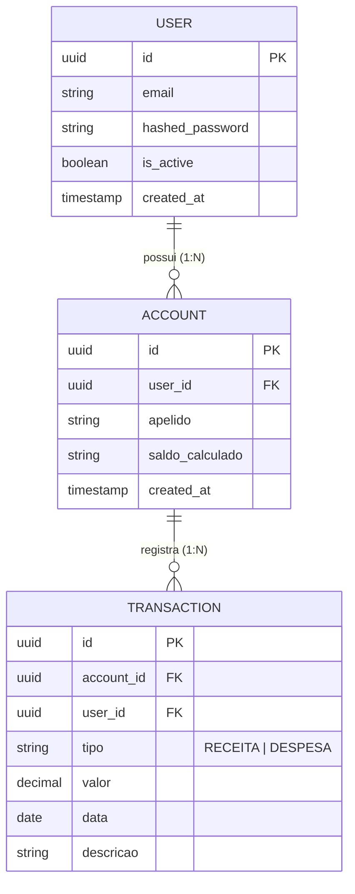

# Data Model: Gestão de Contas e Carteiras (Accounts API)

**Branch**: `002-accounts-management` | **Feature**: [specs/002-accounts-management/spec.md](spec.md)

---

## 1. Entidades Principais

### Account (Conta / Carteira)
Representa a carteira bancária, conta de investimentos ou saldo físico associado a um usuário da plataforma Finance Organizer.

| Atributo | Tipo de Dado | Restrições & Validações | Descrição |
| :--- | :--- | :--- | :--- |
| `id` | `UUID v4` | Primário, obrigatório, gerado pelo backend | Identificador único e universal da conta |
| `user_id` | `UUID v4` | Estrangeiro (User.id), imutável, obrigatório | Identificador do usuário titular proprietário da conta |
| `apelido` | `string` | minLength: 1, maxLength: 100, obrigatório | Nome ou apelido da carteira (ex: "Nubank", "Carteira Física") |
| `saldo_calculado` | `string` | regex `^(?!^[-+.]*$)[+-]?0*\d*\.?\d*$`, default "0.00" | Saldo consolidado dinâmico (receitas - despesas) |
| `created_at` | `string` | formato ISO 8601 (date-time), obrigatório | Timestamp de registro da conta |

---

## 2. Contratos de Entrada (Request Payloads)

### AccountCreate (`POST /api/v1/accounts/`)
Corpo de requisição para abertura de nova carteira.

```json
{
  "apelido": "Nubank"
}
```

- **Campos Obrigatórios**: `apelido`
- **Validações**:
  - `minLength`: 1
  - `maxLength`: 100
  - Tipo: `string` (não nulo)
- **Campos Protegidos / Rejeitados**: O cliente não pode informar `id`, `user_id`, `created_at` ou `saldo_calculado`.

### AccountUpdate (`PUT /api/v1/accounts/{account_id}`)
Corpo de requisição para alteração cadastral da carteira.

```json
{
  "apelido": "Banco Inter"
}
```

- **Campos Opcionais**: `apelido` (aceita string de 1 a 100 caracteres ou `null`)
- **Imutabilidade**: O identificador `id`, o proprietário `user_id` e o `saldo_calculado` são imutáveis via atualização de conta.

---

## 3. Relacionamentos e Integridade



### Regras de Negócio e Estados:
1. **Multi-tenancy Estrito**: Toda conta é isolada por `user_id`. Nenhuma conta pode ser acessada ou alterada por um usuário cujo `sub` no JWT divirja do `user_id` da conta.
2. **Saldo Dinâmico**: O campo `saldo_calculado` não é uma coluna estática manipulada diretamente por CRUD de contas; é derivado das transações associadas.
3. **Ciclo de Vida da Conta**:
   - `Criada`: Saldo inicial `"0.00"`.
   - `Ativa`: Recebe transações, saldo reflete `sum(receitas) - sum(despesas)`.
   - `Excluída`: Removida fisicamente (`Hard Delete`). Transações filhas são excluídas em cascata ou bloqueiam a exclusão se houver proteção de integridade.
