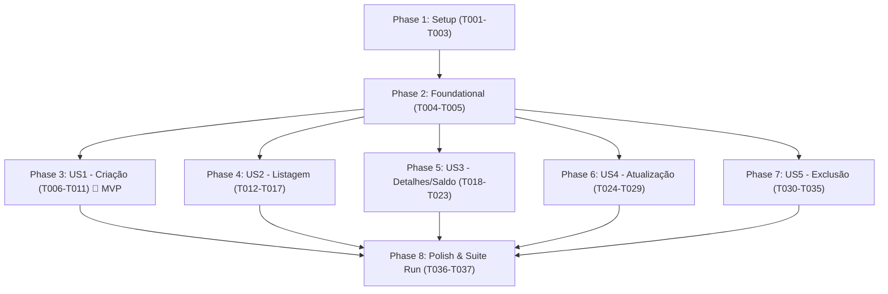

# Tasks: Gestão de Contas e Carteiras (Accounts API Test Automation)

**Input**: Feature specification from `specs/002-accounts-management/spec.md`, implementation plan from `specs/002-accounts-management/plan.md`, data model from `specs/002-accounts-management/data-model.md`, and contracts from `specs/002-accounts-management/contracts/`.

---

## Phase 1: Setup (Shared Infrastructure)

**Purpose**: Inicialização das pastas de payloads e schemas do módulo Accounts.

- [ ] T001 [P] Criar diretórios de payloads e schemas em `src/test/resources/data/payloads/accounts/` e `src/test/resources/data/schemas/accounts/`
- [ ] T002 [P] Criar template de payload base de criação de conta em `src/test/resources/data/payloads/accounts/account-create-request.json`
- [ ] T003 [P] Criar template de payload base de atualização de conta em `src/test/resources/data/payloads/accounts/account-update-request.json`

---

## Phase 2: Foundational (Blocking Prerequisites)

**Purpose**: Schemas contratuais com Fuzzy Matchers do Karate que bloqueiam todas as User Stories.

**⚠️ CRITICAL**: Nenhuma User Story de Accounts pode ser implementada antes da conclusão desta fase.

- [ ] T004 [P] Implementar schema de contrato `AccountResponse` com Karate fuzzy matchers (`#uuid`, `#regex`, `#string`) em `src/test/resources/data/schemas/accounts/account-response-schema.json`
- [ ] T005 [P] Implementar schema de contrato de lista `AccountList` (`#[] accountResponseSchema`) em `src/test/resources/data/schemas/accounts/account-list-schema.json`

**Checkpoint**: Infraestrutura de contratos e payloads base concluída. As User Stories podem ser implementadas.

---

## Phase 3: User Story 1 - Criação de Contas / Carteiras (Priority: P1) 🎯 MVP

**Goal**: Permitir o cadastro de novas contas/carteiras via `POST /api/v1/accounts/`, validando limites de caracteres no apelido (1 a 100), inicialização de saldo em "0.00", validações de erro 422, proteção contra mass assignment e recusa 401 sem autenticação.

**Independent Test**: Executar `mvn test -Dkarate.tags="@create and @accounts"` e validar aprovação de 100% dos cenários (201 Created em dados válidos, 422 em violações de tamanho/tipo/ausência de apelido, sanitização de campos protegidos e 401 sem token).

- [ ] T006 [US1] Criar arquivo de feature com Background, tags `@accounts` e `@create`, e importação do `auth-helper.feature` em `src/test/java/features/accounts/accounts-create.feature`
- [ ] T007 [P] [US1] Implementar cenários felizes SCEN-ACC-01 (apelido válido), SCEN-ACC-02 (limite mín 1 char) e SCEN-ACC-03 (limite máx 100 chars) validando contrato `AccountResponse` em `src/test/java/features/accounts/accounts-create.feature`
- [ ] T008 [P] [US1] Implementar cenários negativos de borda SCEN-ACC-04 (apelido vazio com 0 chars) e SCEN-ACC-05 (apelido excedendo 100 chars) validando HTTP 422 em `src/test/java/features/accounts/accounts-create.feature`
- [ ] T009 [P] [US1] Implementar cenários de validação de schema SCEN-ACC-06 (campo apelido ausente/nulo) e SCEN-ACC-07 (tipos incompatíveis: número, boolean, array) validando HTTP 422 em `src/test/java/features/accounts/accounts-create.feature`
- [ ] T010 [P] [US1] Implementar cenário de segurança contra Mass Assignment SCEN-ACC-08 validando sanitização de id, user_id e saldo_calculado em `src/test/java/features/accounts/accounts-create.feature`
- [ ] T011 [US1] Implementar cenários de autenticação SCEN-ACC-09 (ausência de token, token inválido ou esquema não-bearer) validando HTTP 401 em `src/test/java/features/accounts/accounts-create.feature`

**Checkpoint**: User Story 1 (MVP) concluída e testável de forma 100% independente.

---

## Phase 4: User Story 2 - Listagem e Paginação de Contas (Priority: P1)

**Goal**: Permitir a listagem das carteiras do usuário autenticado via `GET /api/v1/accounts/`, garantindo isolamento multi-tenant estrito (zero vazamento de dados de outros usuários), paginação com `skip` e `limit`, e tratamento de estados vazios.

**Independent Test**: Executar `mvn test -Dkarate.tags="@list and @accounts"` e comprovar retorno 200 com array de contas do usuário logado, lista vazia para usuário recém-criado, segregação de registros entre Usuário A e B, paginação correta e 401 sem autenticação.

- [ ] T012 [US2] Criar arquivo de feature com Background, tags `@accounts` e `@list`, e importação do `auth-helper.feature` em `src/test/java/features/accounts/accounts-list.feature`
- [ ] T013 [US2] Implementar cenário feliz de listagem padrão SCEN-ACC-10 com contas cadastradas validando `account-list-schema.json` em `src/test/java/features/accounts/accounts-list.feature`
- [ ] T014 [P] [US2] Implementar cenário de estado vazio SCEN-ACC-11 para usuário novo sem contas cadastradas validando `[]` em `src/test/java/features/accounts/accounts-list.feature`
- [ ] T015 [US2] Implementar cenário de isolamento multi-tenant SCEN-ACC-12 provisionando Usuário A e B via `auth-helper.feature` e validando segregação estrita em `src/test/java/features/accounts/accounts-list.feature`
- [ ] T016 [P] [US2] Implementar cenários de paginação SCEN-ACC-13 (skip e limit customizados) e SCEN-ACC-14 (skip excedente retornando `[]`) em `src/test/java/features/accounts/accounts-list.feature`
- [ ] T017 [P] [US2] Implementar cenários de validação negativa SCEN-ACC-15 (parâmetros de paginação não numéricos com 422) e SCEN-ACC-16 (ausência de autenticação com 401) em `src/test/java/features/accounts/accounts-list.feature`

**Checkpoint**: User Stories 1 e 2 totalmente funcionais e integradas de forma independente.

---

## Phase 5: User Story 3 - Consulta de Detalhes e Saldo Dinâmico (Priority: P2)

**Goal**: Permitir a consulta de uma conta individual via `GET /api/v1/accounts/{account_id}`, validando a fórmula de saldo contábil (`saldo_calculado = receitas - despesas`), proteção contra IDOR (BOLA), 404 para conta inexistente e 422 para não-UUID.

**Independent Test**: Executar `mvn test -Dkarate.tags="@detail and @accounts"` e verificar retorno 200 OK com saldo dinâmico refletindo transações sintéticas injetadas, bloqueio 404/403 em tentativa de IDOR e recusa 401 sem token.

- [ ] T018 [US3] Criar arquivo de feature com Background, tags `@accounts` e `@detail`, e importação do `auth-helper.feature` em `src/test/java/features/accounts/accounts-get.feature`
- [ ] T019 [US3] Implementar cenário feliz de consulta por ID SCEN-ACC-17 com validação do schema `AccountResponse` em `src/test/java/features/accounts/accounts-get.feature`
- [ ] T020 [US3] Implementar cenário de validação contábil do saldo dinâmico SCEN-ACC-18 injetando receitas e despesas e validando `saldo_calculado` contra a máscara regex em `src/test/java/features/accounts/accounts-get.feature`
- [ ] T021 [P] [US3] Implementar cenário de conta inexistente SCEN-ACC-19 com UUID aleatório validando HTTP 404 em `src/test/java/features/accounts/accounts-get.feature`
- [ ] T022 [US3] Implementar cenário de defesa contra IDOR SCEN-ACC-20 (Usuário A tentando consultar conta do Usuário B) validando HTTP 404 ou 403 em `src/test/java/features/accounts/accounts-get.feature`
- [ ] T023 [P] [US3] Implementar cenários de validação SCEN-ACC-21 (account_id não-UUID validando 422) e SCEN-ACC-22 (requisição sem token com 401) em `src/test/java/features/accounts/accounts-get.feature`

**Checkpoint**: User Stories 1, 2 e 3 validadas e funcionais.

---

## Phase 6: User Story 4 - Atualização de Conta / Carteira (Priority: P2)

**Goal**: Permitir a atualização do apelido de uma conta existente via `PUT /api/v1/accounts/{account_id}`, assegurando a imutabilidade de `id`, `user_id` e `saldo_calculado`, proteção contra IDOR, limites de caracteres e validações de erro.

**Independent Test**: Executar `mvn test -Dkarate.tags="@update and @accounts"` e comprovar alteração bem-sucedida do apelido, preservação de campos imutáveis, 404/403 para tentativa de IDOR e 422 para violações de schema.

- [ ] T024 [US4] Criar arquivo de feature com Background, tags `@accounts` e `@update`, e importação do `auth-helper.feature` em `src/test/java/features/accounts/accounts-update.feature`
- [ ] T025 [P] [US4] Implementar cenários felizes de atualização SCEN-ACC-23 (novo apelido) e SCEN-ACC-24 (limites 1 e 100 caracteres) em `src/test/java/features/accounts/accounts-update.feature`
- [ ] T026 [P] [US4] Implementar cenários negativos de borda de apelido SCEN-ACC-25 (vazio com 0 chars) e SCEN-ACC-26 (> 100 chars) validando HTTP 422 em `src/test/java/features/accounts/accounts-update.feature`
- [ ] T027 [P] [US4] Implementar cenário de conta inexistente SCEN-ACC-27 com UUID aleatório validando HTTP 404 em `src/test/java/features/accounts/accounts-update.feature`
- [ ] T028 [US4] Implementar cenário de defesa contra IDOR SCEN-ACC-28 (Usuário A tentando atualizar conta do Usuário B) validando 404 ou 403 em `src/test/java/features/accounts/accounts-update.feature`
- [ ] T029 [P] [US4] Implementar cenários de integridade e imutabilidade SCEN-ACC-29 (preservação de id, user_id e saldo), SCEN-ACC-30 (account_id não-UUID com 422) e SCEN-ACC-31 (sem token com 401) em `src/test/java/features/accounts/accounts-update.feature`

**Checkpoint**: User Stories 1, 2, 3 e 4 validadas e funcionais.

---

## Phase 7: User Story 5 - Exclusão de Conta e Integridade Referencial (Priority: P2)

**Goal**: Permitir a exclusão de conta via `DELETE /api/v1/accounts/{account_id}`, validando retorno 204 No Content, inacessibilidade subsequente com 404, proteção de integridade referencial com transações filhas vinculadas, defesa contra IDOR e recusa 401.

**Independent Test**: Executar `mvn test -Dkarate.tags="@delete and @accounts"` e comprovar exclusão de conta simples com 204, confirmação de integridade referencial sem crash 500, bloqueio 404/403 em IDOR e recusa 401 sem autenticação.

- [ ] T030 [US5] Criar arquivo de feature com Background, tags `@accounts` e `@delete`, e importação do `auth-helper.feature` em `src/test/java/features/accounts/accounts-delete.feature`
- [ ] T031 [US5] Implementar cenário de exclusão de conta vazia SCEN-ACC-32 validando HTTP 204 No Content e inacessibilidade subsequente com 404 em `src/test/java/features/accounts/accounts-delete.feature`
- [ ] T032 [US5] Implementar cenário de integridade referencial SCEN-ACC-33 com transações filhas vinculadas validando ausência de erro 500 em `src/test/java/features/accounts/accounts-delete.feature`
- [ ] T033 [P] [US5] Implementar cenário de exclusão de conta inexistente SCEN-ACC-34 com UUID aleatório validando HTTP 404 em `src/test/java/features/accounts/accounts-delete.feature`
- [ ] T034 [US5] Implementar cenário de defesa contra IDOR SCEN-ACC-35 (Usuário A tentando deletar conta do Usuário B) validando 404 ou 403 em `src/test/java/features/accounts/accounts-delete.feature`
- [ ] T035 [P] [US5] Implementar cenários de validação SCEN-ACC-36 (account_id não-UUID validando 422) e SCEN-ACC-37 (sem token de autorização com 401) em `src/test/java/features/accounts/accounts-delete.feature`

**Checkpoint**: Todas as 5 User Stories da matriz de Accounts implementadas e independentemente testáveis.

---

## Phase 8: Polish & Cross-Cutting Concerns

**Purpose**: Validação final de paralelismo seguro, privacidade de logs e integridade da suíte completa de Accounts.

- [ ] T036 Validar compatibilidade da suíte completa de contas com o JUnit 5 `TestRunner.java`
- [ ] T037 Executar suíte completa `mvn test -Dkarate.tags="@accounts"` em 3 threads paralelas e verificar relatório HTML em `target/karate-reports/karate-summary.html` per `specs/002-accounts-management/quickstart.md`

---

## Dependencies & Execution Order

### Phase Dependencies



### User Story Dependencies

- **US1 (Criação)**: Depende apenas da Phase 2 (Foundational). Representa o MVP da suíte.
- **US2 (Listagem)**: Depende da Phase 2. Utiliza `auth-helper` e o endpoint de criação para compor massas.
- **US3 (Detalhes/Saldo)**: Depende da Phase 2. Utiliza `auth-helper` e criação de contas para inspecionar saldo.
- **US4 (Atualização)**: Depende da Phase 2. Cria conta isolada e atualiza apelido.
- **US5 (Exclusão)**: Depende da Phase 2. Cria conta isolada e valida exclusão e integridade.

---

## Parallel Execution Opportunities

```bash
# Execução paralela de Setup e Contratos (Fases 1 e 2):
Task T001: "Criar diretórios de payloads e schemas"
Task T002: "Criar template de payload base de criação de conta"
Task T003: "Criar template de payload base de atualização de conta"
Task T004: "Implementar schema de contrato AccountResponse"
Task T005: "Implementar schema de contrato AccountList"

# Execução paralela dentro de US1 (Criação):
Task T007: "Implementar cenários felizes SCEN-ACC-01, SCEN-ACC-02 e SCEN-ACC-03"
Task T008: "Implementar cenários negativos de borda SCEN-ACC-04 e SCEN-ACC-05"
Task T009: "Implementar cenários de validação de schema SCEN-ACC-06 e SCEN-ACC-07"
Task T010: "Implementar cenário de segurança contra Mass Assignment SCEN-ACC-08"

# Execução paralela dentro de US2 (Listagem):
Task T014: "Implementar cenário de estado vazio SCEN-ACC-11"
Task T016: "Implementar cenários de paginação SCEN-ACC-13 e SCEN-ACC-14"
Task T017: "Implementar cenários de validação negativa SCEN-ACC-15 e SCEN-ACC-16"

# Execução paralela dentro de US3 (Detalhes):
Task T021: "Implementar cenário de conta inexistente SCEN-ACC-19"
Task T023: "Implementar cenários de validação SCEN-ACC-21 e SCEN-ACC-22"

# Execução paralela dentro de US4 (Atualização):
Task T025: "Implementar cenários felizes de atualização SCEN-ACC-23 e SCEN-ACC-24"
Task T026: "Implementar cenários negativos de borda SCEN-ACC-25 e SCEN-ACC-26"
Task T027: "Implementar cenário de conta inexistente SCEN-ACC-27"
Task T029: "Implementar cenários de integridade e imutabilidade SCEN-ACC-29, SCEN-ACC-30 e SCEN-ACC-31"

# Execução paralela dentro de US5 (Exclusão):
Task T033: "Implementar cenário de exclusão de conta inexistente SCEN-ACC-34"
Task T035: "Implementar cenários de validação SCEN-ACC-36 e SCEN-ACC-37"
```

---

## Implementation Strategy

### MVP First (User Story 1 Only)
1. Concluir **Phase 1** (Setup) e **Phase 2** (Foundational).
2. Implementar **Phase 3** (User Story 1 - Criação de Contas).
3. **VALIDAÇÃO MVP**: Executar `mvn test -Dkarate.tags="@create and @accounts"`. Todos os cenários de criação e validação de schema devem passar com 0 falhas.

### Entrega Incremental
1. Concluir Setup + Foundational (Base pronta).
2. Entregar US1 (Criação / Limites / 422 / 401) → Testar com `@create`.
3. Entregar US2 (Listagem / Multi-tenant / Paginação) → Testar com `@list`.
4. Entregar US3 (Detalhes / Saldo Dinâmico / IDOR) → Testar com `@detail`.
5. Entregar US4 (Atualização / Imutabilidade / IDOR) → Testar com `@update`.
6. Entregar US5 (Exclusão / Integridade Referencial / IDOR) → Testar com `@delete`.
7. Concluir Polish e validação da suíte completa em 3 threads com `@accounts`.
