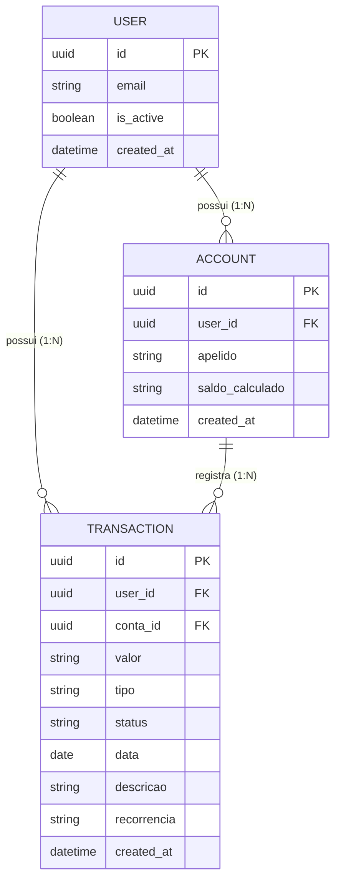
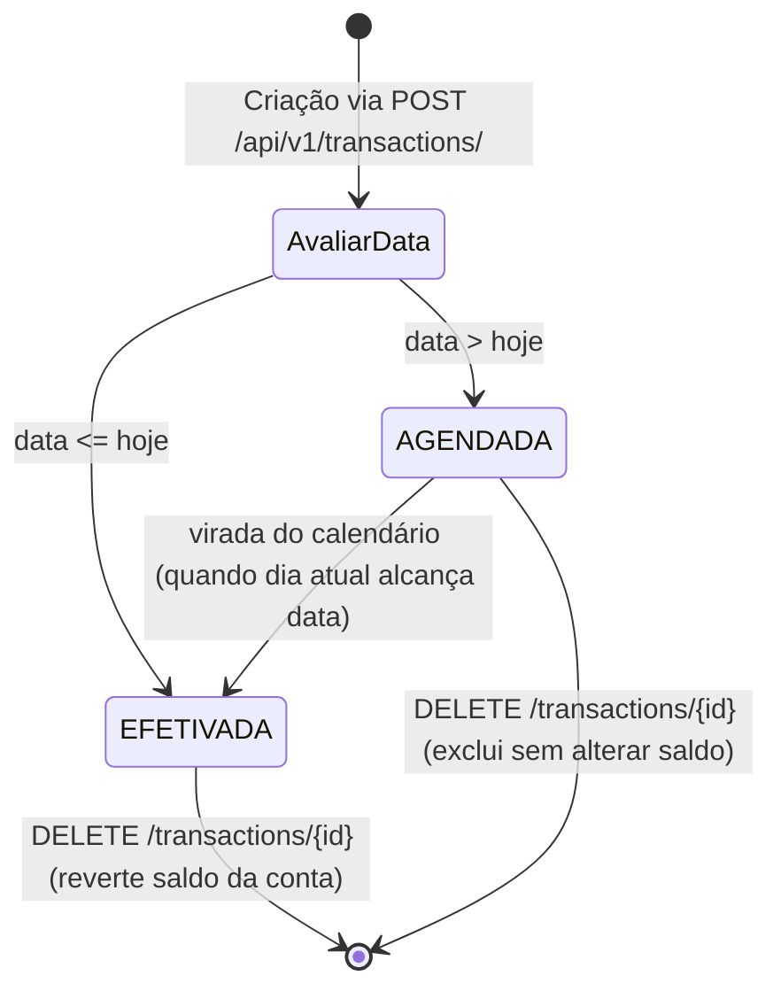

# Data Model: Gestão de Transações e Projeções Financeiras (Transactions API)

**Feature**: `specs/003-transactions-management/spec.md`  
**Status**: Concluído  
**Date**: 2026-09-28

---

## 1. 🏛️ Entidades de Dados

### A. Transação (`Transaction`)
Representa uma movimentação financeira individual de crédito (receita) ou débito (despesa), associada a uma conta bancária e a um usuário.

| Campo | Tipo | Nullable | Restrições & Validações | Descrição |
|:---|:---|:---:|:---|:---|
| `id` | `UUID` (v4) | Não | Gerado pelo backend (`readOnly`) | Identificador único universal da transação |
| `user_id` | `UUID` (v4) | Não | Atribuído via JWT (`readOnly`) | Usuário proprietário da transação |
| `conta_id` | `UUID` (v4) | Não | Obrigatório no payload de criação | Conta bancária/carteira onde a transação ocorre |
| `valor` | `String` / `Number` | Não | `exclusiveMinimum: 0.0`, máx 2 decimais | Valor monetário estritamente positivo |
| `tipo` | `Enum` | Não | `"RECEITA"` ou `"DESPESA"` | Classificação financeira da transação |
| `data` | `String` | Não | Formato ISO date (`YYYY-MM-DD`) | Data de ocorrência ou agendamento |
| `descricao` | `String` | Não | Mínimo 1, máximo 255 caracteres | Descrição textual da movimentação |
| `recorrencia` | `Enum` | Não | Padrão: `"UNICA"` (`"SEMANAL"`, `"MENSAL"`, `"ANUAL"`) | Padrão de repetição da transação |
| `status` | `Enum` | Não | Calculado pelo backend (`readOnly`) | `"EFETIVADA"` (data <= hoje) ou `"AGENDADA"` (data > hoje) |
| `created_at` | `String` | Não | Formato ISO 8601 UTC (`readOnly`) | Timestamp de criação no banco |

---

### B. Projeção Mensal (`TransactionProjectionsResponse`)
Objeto de agregação analítica gerado em tempo de execução para um determinado mês e ano.

| Campo | Tipo | Nullable | Restrições & Validações | Descrição |
|:---|:---|:---:|:---|:---|
| `mes` | `Integer` | Não | Mínimo 1, máximo 12 | Mês de competência da projeção |
| `ano` | `Integer` | Não | Mínimo 1900, máximo 2100 | Ano de competência da projeção |
| `conta_id` | `UUID` | Sim | Opcional | ID da conta filtrada, ou `null` se consolidado global |
| `receitas_previstas` | `String` | Não | Regex `^(?!^[-+.]*$)[+-]?0*\d*\.?\d*$` | Total de receitas previstas no mês (efetivadas + agendadas) |
| `despesas_previstas` | `String` | Não | Regex `^(?!^[-+.]*$)[+-]?0*\d*\.?\d*$` | Total de despesas previstas no mês (efetivadas + agendadas) |
| `saldo_projetado` | `String` | Não | Regex `^(?!^[-+.]*$)[+-]?0*\d*\.?\d*$` | Saldo líquido projetado (`receitas_previstas - despesas_previstas`) |

---

## 2. 🔄 Diagrama Entidade-Relacionamento (ERD)

---

## 3. ⏱️ Máquina de Estados e Regras de Negócio de Status

### Regras de Impacto no Saldo (`saldo_calculado` da Conta):
1. **Receita Efetivada**: Incrementa o `saldo_calculado` da conta (`+ valor`).
2. **Despesa Efetivada**: Decrementa o `saldo_calculado` da conta (`- valor`).
3. **Exclusão de Receita**: Decrementa o `saldo_calculado` da conta (`- valor`), revertendo o lançamento.
4. **Exclusão de Despesa**: Incrementa o `saldo_calculado` da conta (`+ valor`), revertendo o lançamento.
