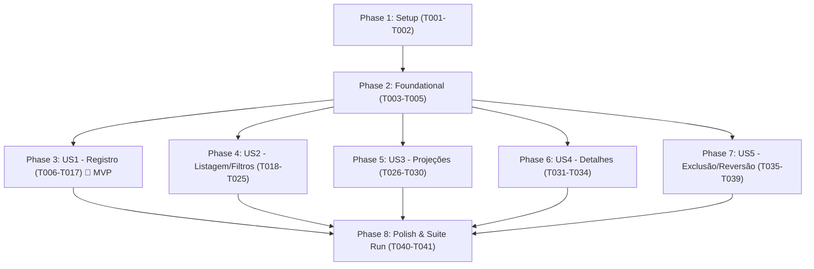

# Tasks: Gestão de Transações e Projeções Financeiras (Transactions API Test Automation)

**Input**: Feature specification from `specs/003-transactions-management/spec.md`, implementation plan from `specs/003-transactions-management/plan.md`, data model from `specs/003-transactions-management/data-model.md`, and contracts from `specs/003-transactions-management/contracts/`.

---

## Phase 1: Setup (Shared Infrastructure)

**Purpose**: Inicialização das pastas de payloads e schemas do módulo Transactions.

- [X] T001 [P] Criar diretórios de payloads e schemas em `src/test/resources/data/payloads/transactions/` e `src/test/resources/data/schemas/transactions/`
- [X] T002 [P] Criar template de payload base de criação de transação em `src/test/resources/data/payloads/transactions/transaction-create-request.json`

---

## Phase 2: Foundational (Blocking Prerequisites)

**Purpose**: Schemas contratuais com Fuzzy Matchers do Karate que bloqueiam todas as User Stories.

**⚠️ CRITICAL**: Nenhuma User Story de Transactions pode ser implementada antes da conclusão desta fase.

- [X] T003 [P] Implementar schema de contrato `TransactionResponse` com Karate fuzzy matchers (`#uuid`, `#regex`, `#string`) em `src/test/resources/data/schemas/transactions/transaction-response-schema.json`
- [X] T004 [P] Implementar schema de contrato de lista `TransactionList` (`#[] transactionResponseSchema`) em `src/test/resources/data/schemas/transactions/transaction-list-schema.json`
- [X] T005 [P] Implementar schema de contrato de projeções `TransactionProjectionsResponse` com Karate fuzzy matchers em `src/test/resources/data/schemas/transactions/transaction-projections-schema.json`

**Checkpoint**: Infraestrutura de contratos e payloads base concluída. As User Stories podem ser implementadas.

---

## Phase 3: User Story 1 - Registro de Transações Financeiras (Priority: P1) 🎯 MVP

**Goal**: Permitir o registro de novas receitas e despesas via `POST /api/v1/transactions/`, atribuindo automaticamente `status: "EFETIVADA"` (para `data <= hoje`) ou `status: "AGENDADA"` (para `data > hoje`), atualizando dinamicamente o `saldo_calculado` da conta associada, validando precisão decimal, recorrência, regras de erro 422, IDOR de conta e 401 sem autenticação.

**Independent Test**: Executar `mvn test -Dkarate.tags="@create and @transactions"` e validar aprovação de 100% dos cenários (201 Created em dados válidos com status temporal correto, impacto imediato no saldo da conta, rejeições 422 para violações de schema e 401 sem token).

- [X] T006 [US1] Criar arquivo de feature com Background, tags `@transactions` e `@create`, e importação do `auth-helper.feature` em `src/test/java/features/transactions/transactions-create.feature`
- [X] T007 [P] [US1] Implementar cenário feliz SCEN-TX-01 (registro de receita com data <= hoje atribuindo status EFETIVADA) validando contrato `TransactionResponse` em `src/test/java/features/transactions/transactions-create.feature`
- [X] T008 [P] [US1] Implementar cenário de regra de negócio temporal SCEN-TX-02 (despesa futura com data > hoje atribuindo status AGENDADA) em `src/test/java/features/transactions/transactions-create.feature`
- [X] T009 [P] [US1] Implementar cenários de recorrência SCEN-TX-03 (UNICA, SEMANAL, MENSAL, ANUAL) em `src/test/java/features/transactions/transactions-create.feature`
- [X] T010 [P] [US1] Implementar cenários de precisão decimal SCEN-TX-04 (inteiro, 1 casa, 2 casas) em `src/test/java/features/transactions/transactions-create.feature`
- [X] T011 [US1] Implementar cenário de impacto dinâmico no saldo da conta SCEN-TX-05 (+ receita, - despesa) em `src/test/java/features/transactions/transactions-create.feature`
- [X] T012 [P] [US1] Implementar cenários negativos de valor monetário SCEN-TX-06 (valor zero, negativo, 3+ decimais, texto com 422) em `src/test/java/features/transactions/transactions-create.feature`
- [X] T013 [P] [US1] Implementar cenários de validação de domínio SCEN-TX-07 (tipo inválido, recorrência fora do enum, data não-ISO com 422) em `src/test/java/features/transactions/transactions-create.feature`
- [X] T014 [P] [US1] Implementar cenários de validação de descrição SCEN-TX-08 (string vazia e acima de 255 chars com 422) em `src/test/java/features/transactions/transactions-create.feature`
- [X] T015 [P] [US1] Implementar cenários de omissão de campos obrigatórios SCEN-TX-09 (valor, tipo, data, descricao, conta_id com 422) em `src/test/java/features/transactions/transactions-create.feature`
- [X] T016 [US1] Implementar cenários de segurança e integridade referencial SCEN-TX-10 (tentativa de vincular a conta de terceiro ou conta inexistente com 404/403) em `src/test/java/features/transactions/transactions-create.feature`
- [X] T017 [US1] Implementar cenários de autenticação SCEN-TX-11 (cabeçalho ausente, token inválido, esquema não-bearer com 401) em `src/test/java/features/transactions/transactions-create.feature`

**Checkpoint**: User Story 1 (MVP) concluída e testável de forma 100% independente.

---

## Phase 4: User Story 2 - Listagem e Filtros Combinados de Transações (Priority: P1)

**Goal**: Permitir a consulta e auditoria de transações via `GET /api/v1/transactions/`, assegurando isolamento multi-tenant estrito (zero vazamento de transações entre usuários), filtros por competência temporal (mês/ano), conta específica, status (`EFETIVADA`/`AGENDADA`), paginação (`skip`, `limit`) e validações 422/401.

**Independent Test**: Executar `mvn test -Dkarate.tags="@list and @transactions"` e comprovar retorno 200 com array de transações do usuário logado, filtros aplicados com precisão, segregação estrita entre Usuário A e B, e recusa 401 sem autenticação.

- [X] T018 [US2] Criar arquivo de feature com Background, tags `@transactions` e `@list`, e importação do `auth-helper.feature` em `src/test/java/features/transactions/transactions-list.feature`
- [X] T019 [US2] Implementar cenário feliz de listagem padrão SCEN-TX-12 validando contrato `transaction-list-schema.json` em `src/test/java/features/transactions/transactions-list.feature`
- [X] T020 [US2] Implementar cenário de isolamento multi-tenant SCEN-TX-13 provisionando Usuário A e B via `auth-helper.feature` e validando segregação estrita em `src/test/java/features/transactions/transactions-list.feature`
- [X] T021 [P] [US2] Implementar cenário de filtro por competência temporal SCEN-TX-14 (mês e ano) em `src/test/java/features/transactions/transactions-list.feature`
- [X] T022 [P] [US2] Implementar cenário de filtro por conta específica SCEN-TX-15 (conta_id) em `src/test/java/features/transactions/transactions-list.feature`
- [X] T023 [P] [US2] Implementar cenário de filtro por status SCEN-TX-16 (EFETIVADA vs AGENDADA) em `src/test/java/features/transactions/transactions-list.feature`
- [X] T024 [P] [US2] Implementar cenário de combinação múltipla de filtros e paginação SCEN-TX-17 em `src/test/java/features/transactions/transactions-list.feature`
- [X] T025 [P] [US2] Implementar cenários de validação negativa SCEN-TX-18 (query params fora do domínio com 422) e SCEN-TX-19 (sem token com 401) em `src/test/java/features/transactions/transactions-list.feature`

**Checkpoint**: User Stories 1 e 2 totalmente funcionais e integradas de forma independente.

---

## Phase 5: User Story 3 - Projeções e Totalizadores Mensais (Priority: P2)

**Goal**: Permitir a consulta analítica do fluxo de caixa e projeção orçamentária via `GET /api/v1/transactions/projections`, validando a fórmula contábil de consolidação (`receitas_previstas`, `despesas_previstas`, `saldo_projetado = receitas - despesas`), filtro opcional por conta, estado zerado (`0.00`) para períodos sem movimentações, e validações de erro 422/401.

**Independent Test**: Executar `mvn test -Dkarate.tags="@projections and @transactions"` e verificar retorno 200 OK com acurácia matemática exata somando lançamentos efetivados e agendados do mês de referência.

- [X] T026 [US3] Criar arquivo de feature com Background, tags `@transactions` e `@projections`, e importação do `auth-helper.feature` em `src/test/java/features/transactions/transactions-projections.feature`
- [X] T027 [US3] Implementar cenário feliz SCEN-TX-20 de cálculo contábil exato de projeção (receitas, despesas e saldo projetado) validando `transaction-projections-schema.json` em `src/test/java/features/transactions/transactions-projections.feature`
- [X] T028 [P] [US3] Implementar cenário de projeção orçamentária restrita a uma conta específica SCEN-TX-21 em `src/test/java/features/transactions/transactions-projections.feature`
- [X] T029 [P] [US3] Implementar cenário de mês sem movimentações SCEN-TX-22 (retorno zerado formatado em 0.00) em `src/test/java/features/transactions/transactions-projections.feature`
- [X] T030 [P] [US3] Implementar cenários negativos SCEN-TX-23 (omissão de mês/ano obrigatórios ou valores inválidos com 422) e SCEN-TX-24 (sem token com 401) em `src/test/java/features/transactions/transactions-projections.feature`

**Checkpoint**: User Stories 1, 2 e 3 validadas e funcionais.

---

## Phase 6: User Story 4 - Consulta de Detalhes de Transação por ID (Priority: P2)

**Goal**: Permitir a consulta individual de uma transação via `GET /api/v1/transactions/{transaction_id}`, validando retorno 200 OK no contrato `TransactionResponse`, defesa estrita contra IDOR (BOLA), 404 para identificador inexistente e 422 para não-UUID.

**Independent Test**: Executar `mvn test -Dkarate.tags="@detail and @transactions"` e verificar devolução dos metadados da transação criada, bloqueio 404/403 em tentativa de IDOR e recusa 401 sem autenticação.

- [X] T031 [US4] Criar arquivo de feature com Background, tags `@transactions` e `@detail`, e importação do `auth-helper.feature` em `src/test/java/features/transactions/transactions-get.feature`
- [X] T032 [US4] Implementar cenário feliz de consulta por ID SCEN-TX-25 com validação de `TransactionResponse` em `src/test/java/features/transactions/transactions-get.feature`
- [X] T033 [US4] Implementar cenário de defesa contra IDOR SCEN-TX-26 (Usuário A tentando consultar transação do Usuário B) validando 404 ou 403 em `src/test/java/features/transactions/transactions-get.feature`
- [X] T034 [P] [US4] Implementar cenários de validação SCEN-TX-27 (UUID não cadastrado com 404 e formato não-UUID com 422) e SCEN-TX-28 (sem autenticação com 401) em `src/test/java/features/transactions/transactions-get.feature`

**Checkpoint**: User Stories 1, 2, 3 e 4 validadas e funcionais.

---

## Phase 7: User Story 5 - Exclusão de Transação e Reversão de Saldo (Priority: P2)

**Goal**: Permitir a exclusão de uma transação via `DELETE /api/v1/transactions/{transaction_id}`, comprovando retorno 204 No Content sem corpo, inacessibilidade subsequente com 404, reversão contábil imediata do impacto financeiro no `saldo_calculado` da conta vinculada, defesa contra IDOR e recusa 401.

**Independent Test**: Executar `mvn test -Dkarate.tags="@delete and @transactions"` e comprovar exclusão bem-sucedida, estorno exato no saldo da conta, bloqueio de deleção de dados de terceiros e 401 sem token.

- [X] T035 [US5] Criar arquivo de feature com Background, tags `@transactions` e `@delete`, e importação do `auth-helper.feature` em `src/test/java/features/transactions/transactions-delete.feature`
- [X] T036 [US5] Implementar cenário feliz de exclusão de transação SCEN-TX-29 validando HTTP 204 No Content e inacessibilidade subsequente com 404 em `src/test/java/features/transactions/transactions-delete.feature`
- [X] T037 [US5] Implementar cenário de reversão contábil imediata de saldo SCEN-TX-30 na conta associada (estorno de receita e despesa) em `src/test/java/features/transactions/transactions-delete.feature`
- [X] T038 [US5] Implementar cenário de defesa contra IDOR SCEN-TX-31 (Usuário A tentando excluir transação do Usuário B) validando 404 ou 403 em `src/test/java/features/transactions/transactions-delete.feature`
- [X] T039 [P] [US5] Implementar cenários de validação SCEN-TX-32 (UUID inexistente com 404 e não-UUID com 422) e SCEN-TX-33 (sem token com 401) em `src/test/java/features/transactions/transactions-delete.feature`

**Checkpoint**: Todas as 5 User Stories da matriz de Transactions implementadas e independentemente testáveis.

---

## Phase 8: Polish & Cross-Cutting Concerns

**Purpose**: Validação final de paralelismo seguro, privacidade de logs e integridade da suíte completa de Transactions.

- [X] T040 Validar compatibilidade da suíte completa de transações com o JUnit 5 `TestRunner.java`
- [X] T041 Executar suíte completa `mvn test -Dkarate.tags="@transactions"` em 3 threads paralelas e verificar relatório HTML em `target/karate-reports/karate-summary.html` per `specs/003-transactions-management/quickstart.md`

---

## Dependencies & Execution Order

### Phase Dependencies



### User Story Dependencies

- **US1 (Registro)**: Depende apenas da Phase 2 (Foundational). Cria massa base e representa o MVP da suíte.
- **US2 (Listagem/Filtros)**: Depende da Phase 2. Utiliza `auth-helper` e criação de transações para validar filtros.
- **US3 (Projeções)**: Depende da Phase 2. Registra receitas e despesas no mês para validar a fórmula contábil.
- **US4 (Detalhes)**: Depende da Phase 2. Registra transação e consulta por ID.
- **US5 (Exclusão)**: Depende da Phase 2. Registra transação, exclui e audita a reversão do saldo da conta.

---

## Parallel Execution Opportunities

```bash
# Execução paralela de Setup e Contratos (Fases 1 e 2):
Task T001: "Criar diretórios de payloads e schemas"
Task T002: "Criar template de payload base de criação de transação"
Task T003: "Implementar schema de contrato TransactionResponse"
Task T004: "Implementar schema de contrato TransactionList"
Task T005: "Implementar schema de contrato TransactionProjectionsResponse"

# Execução paralela dentro de US1 (Registro):
Task T007: "Implementar cenário SCEN-TX-01 (receita data <= hoje -> EFETIVADA)"
Task T008: "Implementar cenário SCEN-TX-02 (despesa futura -> AGENDADA)"
Task T009: "Implementar cenários de recorrência SCEN-TX-03"
Task T010: "Implementar cenários de precisão decimal SCEN-TX-04"
Task T012: "Implementar cenários negativos de valor monetário SCEN-TX-06"
Task T013: "Implementar cenários de validação de domínio SCEN-TX-07"
Task T014: "Implementar cenários de validação de descrição SCEN-TX-08"
Task T015: "Implementar cenários de omissão de campos obrigatórios SCEN-TX-09"

# Execução paralela dentro de US2 (Listagem):
Task T021: "Implementar cenário de filtro por competência temporal SCEN-TX-14"
Task T022: "Implementar cenário de filtro por conta específica SCEN-TX-15"
Task T023: "Implementar cenário de filtro por status SCEN-TX-16"
Task T024: "Implementar cenário de combinação múltipla de filtros e paginação SCEN-TX-17"
Task T025: "Implementar cenários de validação negativa SCEN-TX-18 e SCEN-TX-19"

# Execução paralela dentro de US3 (Projeções):
Task T028: "Implementar cenário de projeção orçamentária restrita a uma conta específica SCEN-TX-21"
Task T029: "Implementar cenário de mês sem movimentações SCEN-TX-22"
Task T030: "Implementar cenários negativos SCEN-TX-23 e SCEN-TX-24"

# Execução paralela dentro de US4 (Detalhes):
Task T034: "Implementar cenários de validação SCEN-TX-27 e SCEN-TX-28"

# Execução paralela dentro de US5 (Exclusão):
Task T039: "Implementar cenários de validação SCEN-TX-32 e SCEN-TX-33"
```

---

## Implementation Strategy

### MVP First (User Story 1 Only)
1. Concluir **Phase 1** (Setup) e **Phase 2** (Foundational).
2. Implementar **Phase 3** (User Story 1 - Registro de Transações Financeiras).
3. **VALIDAÇÃO MVP**: Executar `mvn test -Dkarate.tags="@create and @transactions"`. Todos os cenários de criação, status temporal, precisão decimal e regras de negócio devem passar com 0 falhas.

### Entrega Incremental
1. Concluir Setup + Foundational (Infraestrutura de schemas e payloads pronta).
2. Entregar US1 (Registro / Status Temporal / Validações 422 / 401) → Testar com `@create`.
3. Entregar US2 (Listagem / Filtros Combinados / Paginação / Multi-tenant) → Testar com `@list`.
4. Entregar US3 (Projeções Mensais / Acurácia Contábil / Filtro por Conta) → Testar com `@projections`.
5. Entregar US4 (Detalhes por ID / Defesa IDOR) → Testar com `@detail`.
6. Entregar US5 (Exclusão / Reversão Atômica de Saldo / Defesa IDOR) → Testar com `@delete`.
7. Concluir Polish e validação da suíte completa em 3 threads com `@transactions`.
