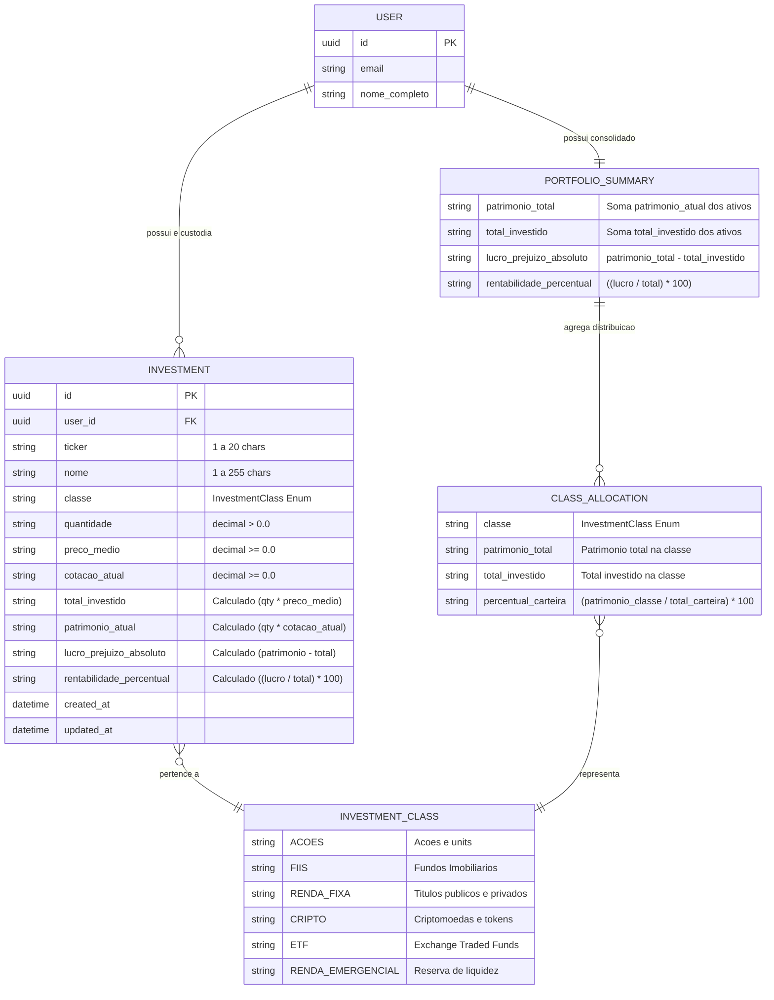
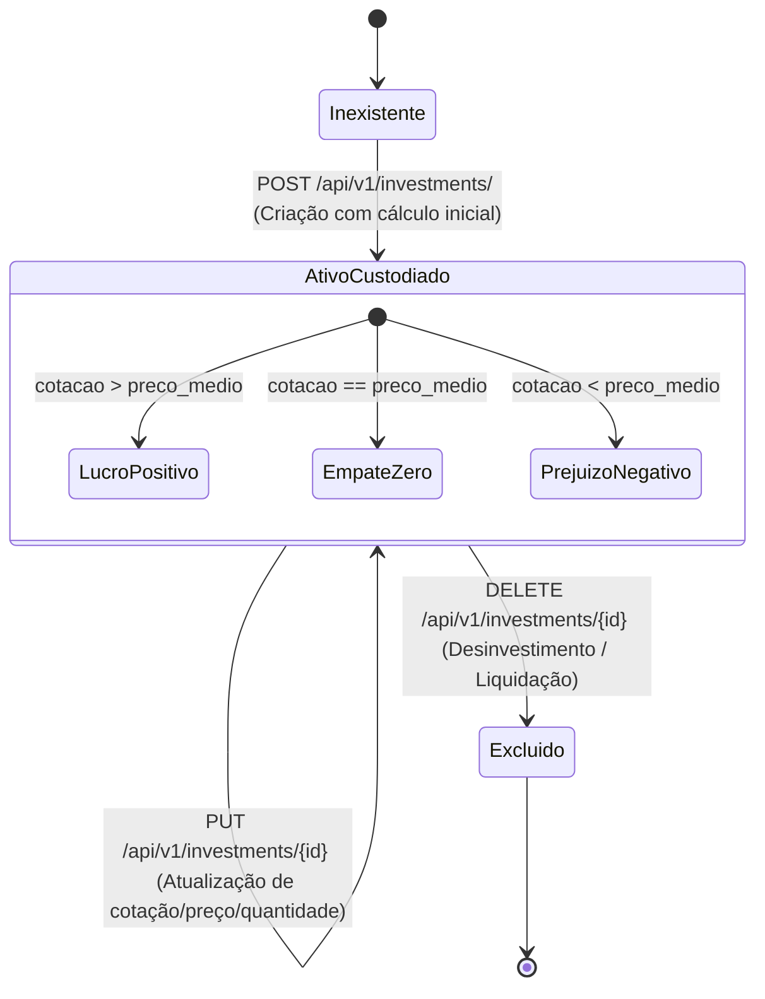

# Data Model: Gestão de Portfólio de Investimentos (Investments API)

**Feature**: `004-investments-portfolio`  
**Date**: 2026-09-28  
**Status**: Completed  

---

## 1. Diagrama Entidade-Relacionamento (ERD)

---

## 2. Entidades Detalhadas

### 2.1 Entidade: `Investment`

Representa a posição individual de custódia de um ativo no portfólio do usuário.

| Campo | Tipo | Obrigatoriedade | Regras de Validação & Restrições |
| :--- | :--- | :---: | :--- |
| `id` | UUID v4 | Sistema | Gerado na persistência; imutável via API. |
| `user_id` | UUID v4 | Sistema | Extraído exclusivamente do token Bearer JWT (`sub`). |
| `ticker` | String | Obrigatório | Min 1, Max 20 caracteres (ex: `"PETR4"`, `"BTC"`, `"HGLG11"`). |
| `nome` | String | Obrigatório | Min 1, Max 255 caracteres (ex: `"Petrobras PN"`). |
| `classe` | String (Enum) | Obrigatório | Restrito a: `ACOES`, `FIIS`, `RENDA_FIXA`, `CRIPTO`, `ETF`, `RENDA_EMERGENCIAL`. |
| `quantidade` | String/Number | Obrigatório | Estritamente maior que zero (`exclusiveMinimum: 0.0`). Regex: `^(?!^[-+.]*$)[+-]?0*\\d*\\.?\\d*$`. Suporta frações. |
| `preco_medio` | String/Number | Obrigatório | Maior ou igual a zero (`minimum: 0.0`). Custo médio unitário ponderado. |
| `cotacao_atual` | String/Number | Obrigatório | Maior ou igual a zero (`minimum: 0.0`). Valor de mercado unitário corrente. |
| `total_investido` | String | Read-Only | Computado: `quantidade * preco_medio`. |
| `patrimonio_atual` | String | Read-Only | Computado: `quantidade * cotacao_atual`. |
| `lucro_prejuizo_absoluto` | String | Read-Only | Computado: `patrimonio_atual - total_investido`. Permite valor negativo (prejuízo) ou positivo. |
| `rentabilidade_percentual` | String | Read-Only | Computado: `((patrimonio_atual - total_investido) / total_investido) * 100`. Se `total_investido == 0`, retorna `"0.00"`. |
| `created_at` | DateTime (ISO 8601)| Sistema | Timestamp de cadastro original da custódia. |
| `updated_at` | DateTime (ISO 8601)| Sistema | Timestamp da última atualização ou reavaliação de cotação. |

---

### 2.2 Entidade: `PortfolioSummary`

Consolidação dinâmica de toda a carteira de investimentos do usuário.

| Campo | Tipo | Descrição & Fórmula Matemática |
| :--- | :--- | :--- |
| `patrimonio_total` | String | $\sum \text{patrimonio\_atual}$ de todos os ativos do usuário logado. |
| `total_investido` | String | $\sum \text{total\_investido}$ de todos os ativos do usuário logado. |
| `lucro_prejuizo_absoluto` | String | $\text{patrimonio\_total} - \text{total\_investido}$. |
| `rentabilidade_percentual` | String | $((\text{patrimonio\_total} - \text{total\_investido}) / \text{total\_investido}) \times 100$. |
| `alocacao_por_classe` | Array[`ClassAllocation`] | Distribuição segregada por modalidade de investimento. Retorna `[]` quando carteira vazia. |

---

### 2.3 Entidade: `ClassAllocation`

Fatia patrimonial de uma classe dentro da carteira do usuário.

| Campo | Tipo | Descrição & Fórmula Matemática |
| :--- | :--- | :--- |
| `classe` | String (Enum) | Classe correspondente (`InvestmentClass`). |
| `patrimonio_total` | String | $\sum \text{patrimonio\_atual}$ dos ativos pertencentes a esta classe. |
| `total_investido` | String | $\sum \text{total\_investido}$ dos ativos pertencentes a esta classe. |
| `percentual_carteira` | String | $(\text{patrimonio\_total}_{\text{classe}} / \text{patrimonio\_total}_{\text{carteira}}) \times 100$. |

---

## 3. Ciclo de Vida e Transições de Estado

