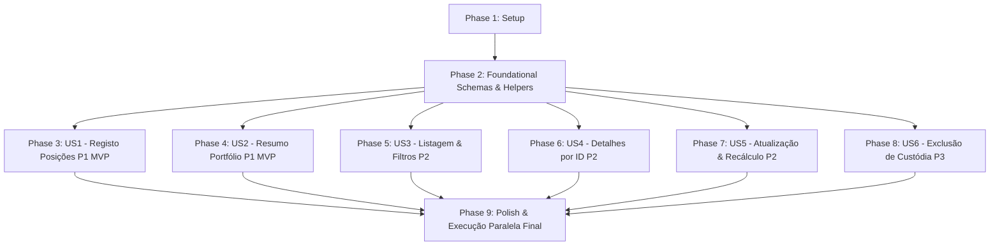

# Tasks: Gestão de Portfólio de Investimentos (Investments API Test Automation)

**Input**: Feature specification from `specs/004-investments-portfolio/spec.md`, implementation plan from `specs/004-investments-portfolio/plan.md`, data model from `specs/004-investments-portfolio/data-model.md`, and contracts from `specs/004-investments-portfolio/contracts/`.

---

## Phase 1: Setup (Shared Infrastructure)

**Purpose**: Inicialização das pastas de payloads, schemas e templates do módulo Investments.

- [ ] T001 [P] Criar diretórios de payloads e schemas em `src/test/resources/data/payloads/investments/` e `src/test/resources/data/schemas/investments/`
- [ ] T002 [P] Criar template de payload base de criação de investimento em `src/test/resources/data/payloads/investments/investment-create-request.json`
- [ ] T003 [P] Criar template de payload base de atualização de investimento em `src/test/resources/data/payloads/investments/investment-update-request.json`

---

## Phase 2: Foundational (Blocking Prerequisites)

**Purpose**: Schemas contratuais com Fuzzy Matchers do Karate e helper reutilizável que bloqueiam todas as User Stories.

**⚠️ CRITICAL**: Nenhuma User Story de Investments pode ser executada ou validada antes da conclusão desta fase.

- [ ] T004 [P] Implementar schema de contrato `InvestmentResponse` com Karate fuzzy matchers (`#uuid`, `#regex`, `#string`) em `src/test/resources/data/schemas/investments/investment-response-schema.json`
- [ ] T005 [P] Implementar schema de contrato de lista `InvestmentList` (`#[] investmentResponseSchema`) em `src/test/resources/data/schemas/investments/investment-list-schema.json`
- [ ] T006 [P] Implementar schema de contrato `ClassAllocation` com Karate fuzzy matchers em `src/test/resources/data/schemas/investments/class-allocation-schema.json`
- [ ] T007 [P] Implementar schema de contrato `PortfolioSummaryResponse` com Karate fuzzy matchers em `src/test/resources/data/schemas/investments/portfolio-summary-schema.json`
- [ ] T008 Implementar helper reutilizável de setup de custódia com `@ignore` em `src/test/java/features/helpers/investment-helper.feature`

**Checkpoint**: Infraestrutura de contratos e payloads base concluída. As User Stories podem ser implementadas.

---

## Phase 3: User Story 1 - Registo de Posições de Investimento (Priority: P1) 🎯 MVP

**Goal**: Permitir o cadastro de posições de custódia via `POST /api/v1/investments/`, validando o suporte a todas as 6 classes de `InvestmentClass`, grandezas decimais de alta precisão (Cripto), recálculo imediato de métricas derivadas (`total_investido`, `patrimonio_atual`, `lucro_prejuizo_absoluto`, `rentabilidade_percentual`), regras de erro 422 para limites e campos obrigatórios, sanitização de campos read-only e 401 sem autenticação.

**Independent Test**: Executar `mvn test -Dkarate.tags="@create and @investments"` e verificar aprovação de 100% dos cenários (201 Created com cálculos matemáticos exatos, rejeições 422 para violações de contrato e 401 sem token).

- [ ] T009 [US1] Criar arquivo de feature com Background, tags `@investments` e `@create`, e importação do `auth-helper.feature` em `src/test/java/features/investments/investments-create.feature`
- [ ] T010 [P] [US1] Implementar cenário feliz SCEN-INV-01 (cadastro com lucro positivo e métricas derivadas calculadas) validando contrato `InvestmentResponse` em `src/test/java/features/investments/investments-create.feature`
- [ ] T011 [P] [US1] Implementar cenário parametrizado SCEN-INV-02 cobrindo todas as classes de ativo do enum `InvestmentClass` (`ACOES`, `FIIS`, `RENDA_FIXA`, `CRIPTO`, `ETF`, `RENDA_EMERGENCIAL`) em `src/test/java/features/investments/investments-create.feature`
- [ ] T012 [P] [US1] Implementar cenário de alta precisão decimal SCEN-INV-03 (fracionamento de criptoativos em quantidade e cotação) em `src/test/java/features/investments/investments-create.feature`
- [ ] T013 [P] [US1] Implementar cenários financeiros extremos SCEN-INV-04 (rentabilidade nula e queda severa/drawdown com sinal negativo) em `src/test/java/features/investments/investments-create.feature`
- [ ] T014 [P] [US1] Implementar cenários de limite de tamanho SCEN-INV-05 (ticker 1..20 chars e nome 1..255 chars, aceitando limites e rejeitando com 422 se violados) em `src/test/java/features/investments/investments-create.feature`
- [ ] T015 [P] [US1] Implementar cenários de omissão de campos obrigatórios SCEN-INV-06 (ticker, nome, classe, quantidade, preco_medio, cotacao_atual com 422) em `src/test/java/features/investments/investments-create.feature`
- [ ] T016 [P] [US1] Implementar cenário de classe inexistente ou fora do enum SCEN-INV-07 (com 422) em `src/test/java/features/investments/investments-create.feature`
- [ ] T017 [P] [US1] Implementar cenários de restrições numéricas contratuais SCEN-INV-08 (quantidade <= 0, preco_medio < 0, cotacao_atual < 0 com 422) em `src/test/java/features/investments/investments-create.feature`
- [ ] T018 [US1] Implementar cenário de sanitização contra injeção de campos read-only e user_id forçado SCEN-INV-09 em `src/test/java/features/investments/investments-create.feature`
- [ ] T019 [US1] Implementar cenários de autenticação SCEN-INV-10 (token ausente, expirado e malformado com 401) em `src/test/java/features/investments/investments-create.feature`

**Checkpoint**: User Story 1 (MVP de Registro) concluída e testável de forma 100% independente.

---

## Phase 4: User Story 2 - Métricas Consolidadas do Portfólio (Priority: P1) 🎯 MVP

**Goal**: Permitir a consolidação patrimonial global e distribuição da carteira via `GET /api/v1/investments/summary`, validando estado de carteira vazia (todos os campos zerados e lista vazia), agregação multi-classe, invariante da soma de alocação de classes (100%), isolamento estrito multi-tenancy e rejeição 401 sem autenticação.

**Independent Test**: Executar `mvn test -Dkarate.tags="@summary and @investments"` e verificar retorno 200 OK no contrato `PortfolioSummaryResponse`, acurácia matemática na agregação de múltiplos ativos e segregação total entre usuários.

- [ ] T020 [US2] Criar arquivo de feature com Background, tags `@investments` e `@summary`, e importação do `auth-helper.feature` em `src/test/java/features/investments/investments-summary.feature`
- [ ] T021 [US2] Implementar cenário feliz de carteira vazia SCEN-INV-11 (retorno zerado formatado em 0.00 e alocacao_por_classe vazia) em `src/test/java/features/investments/investments-summary.feature`
- [ ] T022 [US2] Implementar cenário de agregação multi-classe SCEN-INV-12 (validação de total_investido, patrimonio_total, lucro acumulado e alocação por classe) em `src/test/java/features/investments/investments-summary.feature`
- [ ] T023 [US2] Implementar cenário de validação matemática da invariante da carteira SCEN-INV-13 (soma de percentual_carteira de todas as classes = 100%) em `src/test/java/features/investments/investments-summary.feature`
- [ ] T024 [US2] Implementar cenário de isolamento estrito multi-tenancy SCEN-INV-14 (ativos do Usuário A não interferem no resumo do Usuário B) em `src/test/java/features/investments/investments-summary.feature`
- [ ] T025 [P] [US2] Implementar cenário de chamada não autenticada SCEN-INV-15 (com 401) em `src/test/java/features/investments/investments-summary.feature`

**Checkpoint**: User Stories 1 e 2 (Core MVP) concluídas e testáveis de forma independente.

---

## Phase 5: User Story 3 - Listagem Paginada e Filtrada de Investimentos (Priority: P2)

**Goal**: Permitir a listagem de posições de investimento via `GET /api/v1/investments/`, garantindo isolamento de registros por usuário, filtragem por classe de ativo, paginação com `skip` e `limit`, validações de erro 422 para parâmetros fora do domínio e 401 sem autenticação.

**Independent Test**: Executar `mvn test -Dkarate.tags="@list and @investments"` e verificar retorno 200 OK com array de posições exclusivas do usuário logado, filtros por classe aplicados com exatidão e recusa 422/401 em entradas inválidas.

- [ ] T026 [US3] Criar arquivo de feature com Background, tags `@investments` e `@list`, e importação do `auth-helper.feature` em `src/test/java/features/investments/investments-list.feature`
- [ ] T027 [US3] Implementar cenário de listagem geral exclusiva do usuário autenticado SCEN-INV-16 (validando contrato `investment-list-schema.json`) em `src/test/java/features/investments/investments-list.feature`
- [ ] T028 [P] [US3] Implementar cenário parametrizado de filtro por classe de ativo SCEN-INV-17 (todas as 6 classes de `InvestmentClass`) em `src/test/java/features/investments/investments-list.feature`
- [ ] T029 [P] [US3] Implementar cenário de paginação com skip e limit SCEN-INV-18 em `src/test/java/features/investments/investments-list.feature`
- [ ] T030 [P] [US3] Implementar cenário de rejeição de query param classe inválida SCEN-INV-19 (com 422) em `src/test/java/features/investments/investments-list.feature`
- [ ] T031 [P] [US3] Implementar cenários de limites de paginação inválidos SCEN-INV-20 (skip < 0, limit < 1, limit > 100 com 422) em `src/test/java/features/investments/investments-list.feature`
- [ ] T032 [P] [US3] Implementar cenário de listagem sem autenticação SCEN-INV-21 (com 401) em `src/test/java/features/investments/investments-list.feature`

**Checkpoint**: User Stories 1, 2 e 3 validadas e funcionais.

---

## Phase 6: User Story 4 - Consulta de Posição Específica por ID (Priority: P2)

**Goal**: Permitir a consulta detalhada de uma posição de investimento via `GET /api/v1/investments/{investment_id}`, assegurando retorno 200 OK no contrato `InvestmentResponse`, proteção contra IDOR (BOLA), tratamento de 404 para ID inexistente, 422 para não-UUID e 401 sem token.

**Independent Test**: Executar `mvn test -Dkarate.tags="@detail and @investments"` e verificar obtenção dos dados do ativo, bloqueio 404/403 na tentativa de acesso cruzado entre usuários e rejeição 401 sem autenticação.

- [ ] T033 [US4] Criar arquivo de feature com Background, tags `@investments` e `@detail`, e importação do `auth-helper.feature` em `src/test/java/features/investments/investments-get.feature`
- [ ] T034 [US4] Implementar cenário feliz de consulta por ID próprio SCEN-INV-22 validando contrato `InvestmentResponse` em `src/test/java/features/investments/investments-get.feature`
- [ ] T035 [US4] Implementar cenário de defesa contra IDOR SCEN-INV-23 (Usuário A tentando consultar investimento do Usuário B com 404 ou 403) em `src/test/java/features/investments/investments-get.feature`
- [ ] T036 [P] [US4] Implementar cenário de ID inexistente SCEN-INV-24 (UUID inexistente com 404) em `src/test/java/features/investments/investments-get.feature`
- [ ] T037 [P] [US4] Implementar cenário de ID malformado SCEN-INV-25 (não-UUID com 422) em `src/test/java/features/investments/investments-get.feature`
- [ ] T038 [P] [US4] Implementar cenário de consulta sem autenticação SCEN-INV-26 (com 401) em `src/test/java/features/investments/investments-get.feature`

**Checkpoint**: User Stories 1, 2, 3 e 4 validadas e funcionais.

---

## Phase 7: User Story 5 - Atualização de Ativos e Recálculo Dinâmico (Priority: P2)

**Goal**: Permitir a atualização parcial de propriedades de custódia via `PUT /api/v1/investments/{investment_id}`, verificando recálculo dinâmico imediato das métricas derivadas, propagação das alterações em `/investments/summary`, bloqueio contra IDOR, validações de erro 422 e rejeição 401 sem autenticação.

**Independent Test**: Executar `mvn test -Dkarate.tags="@update and @investments"` e verificar retorno 200 OK com cotação atualizada, recálculo imediato de patrimônio e rentabilidade, reflexo em `/summary` e bloqueio 404/403 para IDOR.

- [ ] T039 [US5] Criar arquivo de feature com Background, tags `@investments` e `@update`, e importação do `auth-helper.feature` em `src/test/java/features/investments/investments-update.feature`
- [ ] T040 [US5] Implementar cenário de atualização de cotação atual e recálculo dinâmico SCEN-INV-27 (novo patrimônio, lucro e rentabilidade) em `src/test/java/features/investments/investments-update.feature`
- [ ] T041 [US5] Implementar cenário de atualização de quantidade e preço médio SCEN-INV-28 em `src/test/java/features/investments/investments-update.feature`
- [ ] T042 [US5] Implementar cenário de reflexo imediato do PUT no consolidado `/investments/summary` SCEN-INV-29 em `src/test/java/features/investments/investments-update.feature`
- [ ] T043 [P] [US5] Implementar cenários de validação negativa SCEN-INV-30 (quantidade <= 0, preco_medio < 0, cotacao_atual < 0, limites de string com 422) em `src/test/java/features/investments/investments-update.feature`
- [ ] T044 [US5] Implementar cenário de defesa contra IDOR na atualização SCEN-INV-31 (Usuário A tentando alterar ativo do Usuário B com 404 ou 403) em `src/test/java/features/investments/investments-update.feature`
- [ ] T045 [P] [US5] Implementar cenários de ID inexistente SCEN-INV-32 (404) e ID não-UUID SCEN-INV-33 (422) em `src/test/java/features/investments/investments-update.feature`
- [ ] T046 [P] [US5] Implementar cenário de atualização sem autenticação SCEN-INV-34 (com 401) em `src/test/java/features/investments/investments-update.feature`

**Checkpoint**: User Stories 1 a 5 validadas e funcionais.

---

## Phase 8: User Story 6 - Encerramento de Custódia e Exclusão (Priority: P3)

**Goal**: Permitir a exclusão de posições de investimento via `DELETE /api/v1/investments/{investment_id}`, verificando retorno 204 No Content, remoção definitiva (404 no GET subsequente), estorno imediato do impacto patrimonial em `/investments/summary`, defesa contra IDOR e validações 422/401.

**Independent Test**: Executar `mvn test -Dkarate.tags="@delete and @investments"` e verificar devolução 204, ausência do ativo na listagem e no resumo, e bloqueio de exclusão em ativos de outros usuários.

- [ ] T047 [US6] Criar arquivo de feature com Background, tags `@investments` e `@delete`, e importação do `auth-helper.feature` em `src/test/java/features/investments/investments-delete.feature`
- [ ] T048 [US6] Implementar cenário feliz de exclusão de ativo próprio SCEN-INV-35 (com 204 No Content) em `src/test/java/features/investments/investments-delete.feature`
- [ ] T049 [US6] Implementar cenário de verificação de persistência SCEN-INV-36 (GET subsequente retorna 404 Not Found) em `src/test/java/features/investments/investments-delete.feature`
- [ ] T050 [US6] Implementar cenário de impacto dinâmico no resumo da carteira SCEN-INV-37 (decremento imediato do ativo excluído em `/investments/summary`) em `src/test/java/features/investments/investments-delete.feature`
- [ ] T051 [US6] Implementar cenário de defesa contra IDOR na exclusão SCEN-INV-38 (Usuário A tentando excluir ativo do Usuário B com 404 ou 403) em `src/test/java/features/investments/investments-delete.feature`
- [ ] T052 [P] [US6] Implementar cenários de ID inexistente SCEN-INV-39 (404) e ID malformado SCEN-INV-40 (422) em `src/test/java/features/investments/investments-delete.feature`
- [ ] T053 [P] [US6] Implementar cenário de exclusão sem autenticação SCEN-INV-41 (com 401) em `src/test/java/features/investments/investments-delete.feature`

**Checkpoint**: Todas as 6 User Stories implementadas e testáveis de forma 100% independente.

---

## Phase 9: Polish & Cross-Cutting Concerns

**Purpose**: Execução ponta a ponta, validação de paralelismo e geração do relatório consolidado de testes.

- [ ] T054 Executar a suíte completa de testes de investimentos em paralelo com 3 threads (`mvn test -Dkarate.tags="@investments"`)
- [ ] T055 Executar suíte de testes de segurança IDOR em `mvn test -Dkarate.tags="@idor and @investments"`
- [ ] T056 [P] Validar geração do relatório consolidado em `target/karate-reports/karate-summary.html`
- [ ] T057 Validar ausência de tokens ou segredos expostos em logs e conformidade com o Zero-Failure Standard (`results.getFailCount() == 0`)

---

## Dependencies & Execution Order

### Phase Dependencies



- **Phase 1 (Setup)**: Pode iniciar imediatamente.
- **Phase 2 (Foundational)**: Bloqueia todas as User Stories.
- **Phases 3 a 8 (User Stories)**: Independentes entre si; cada cenário provisiona seus próprios dados e usuários via `auth-helper.feature` e `investment-helper.feature`. Podem ser desenvolvidas sequencialmente por prioridade ou em paralelo.
- **Phase 9 (Polish)**: Depende da conclusão de todas as User Stories para validação final.

---

## Parallel Example: User Story 1

```bash
# Executar cenários unitários/independentes de validação de US1 em paralelo:
Task: "SCEN-INV-01 Cadastro feliz em src/test/java/features/investments/investments-create.feature"
Task: "SCEN-INV-02 Classes parametrizadas em src/test/java/features/investments/investments-create.feature"
Task: "SCEN-INV-05 Validação de tamanho em src/test/java/features/investments/investments-create.feature"
Task: "SCEN-INV-06 Omissão de campos em src/test/java/features/investments/investments-create.feature"
```

---

## Implementation Strategy

### MVP First (User Stories 1 e 2)
1. Concluir Setup (Phase 1) e Foundational (Phase 2).
2. Implementar User Story 1 (Registo de Posições - `POST`).
3. Implementar User Story 2 (Métricas Consolidadas - `GET /summary`).
4. **Validar MVP**: Executar `mvn test -Dkarate.tags="(@create or @summary) and @investments"`.

### Incremental Delivery
1. Adicionar User Story 3 (Listagem e Filtros por classe).
2. Adicionar User Story 4 (Detalhe por ID e proteção IDOR).
3. Adicionar User Story 5 (Atualização com recálculo dinâmico).
4. Adicionar User Story 6 (Exclusão e desinvestimento).
5. Executar Polish final com execução paralela em 3 threads (`mvn test -Dkarate.tags="@investments"`).
